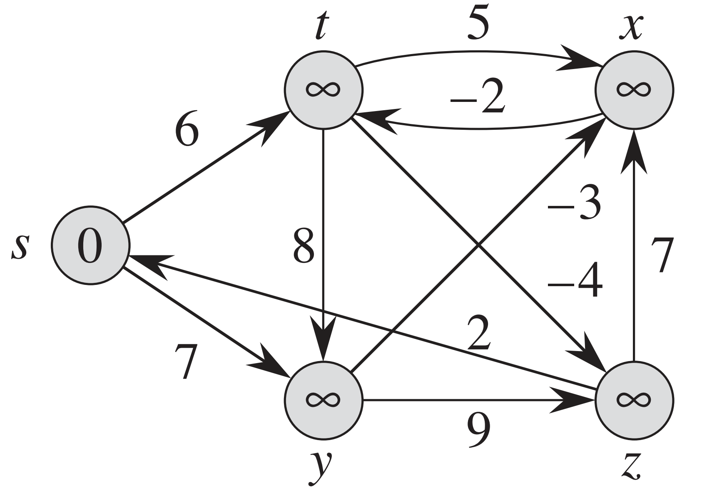

# Hands-on Activity 14

## Questions
Implement and test on examples from the book. Then upload your source code to GitHub. Do this for the following algorithms:
1. Dijkstra's algorithm
2. Bellman-Ford algorithm
3. Floyd-Warshall algorithm


## Answer

### Dijkstra's Algorithm

To implement Dijkstra's algorithm in Java and simulate the given graph, we'll structure the code into separate classes. Here's how we can organize it:

1. **`DijkstraNode` Class**: Represents a node in the graph in [DijkstraNode.java](dijkstra/DijkstraNode.java)
2. **`DijkstraEdge` Class**: Represents an edge between two nodes with a weight in [DijkstraEdge.java](dijkstra/DijkstraEdge.java) 
3. **`DijkstraGraph` Class**: Represents the entire graph in [DijkstraGraph.java](dijkstra/DijkstraGraph.java)
4. **`DijkstraAlgorithm` Class**: Contains the implementation of Dijkstra's algorithm in [DijkstraAlgorithm.java](dijkstra/DijkstraAlgorithm.java).

Below is the code structure:

### DijkstraNode Class
```java
public class DijkstraNode implements Comparable<DijkstraNode> {
	public String name;
	public List<DijkstraEdge> dijkstraEdges = new ArrayList<>();
	public double distance = Double.MAX_VALUE; // Initialize as infinity
	public DijkstraNode previous = null;

	public DijkstraNode(String name) {
		this.name = name;
	}

	@Override
	public int compareTo(DijkstraNode other) {
		return Double.compare(this.distance, other.distance);
	}
}
```

### DijkstraEdge Class
```java
public class DijkstraEdge {
	public DijkstraNode target;
	public double weight;

	public DijkstraEdge(DijkstraNode target, double weight) {
		this.target = target;
		this.weight = weight;
	}
}
```

### DijkstraGraph Class
```java
public class DijkstraGraph {
	public Map<String, DijkstraNode> nodes = new HashMap<>();

	public void addNode(String name) {
		nodes.putIfAbsent(name, new DijkstraNode(name));
	}

	public void addEdge(String source, String target, double weight) {
		DijkstraNode sourceNode = nodes.get(source);
		DijkstraNode targetNode = nodes.get(target);

		if (sourceNode != null && targetNode != null) {
			sourceNode.dijkstraEdges.add(new DijkstraEdge(targetNode, weight));
		}
	}

	public DijkstraNode getNode(String name) {
		return nodes.get(name);
	}
}
```

### DijkstraAlgorithm Class
```java
public class DijkstraAlgorithm {
	public static void calculateShortestPath(DijkstraGraph dijkstraGraph, String startName) {
		DijkstraNode startNode = dijkstraGraph.getNode(startName);
		if (startNode == null) return;

		PriorityQueue<DijkstraNode> priorityQueue = new PriorityQueue<>();
		startNode.distance = 0;
		priorityQueue.add(startNode);

		while (!priorityQueue.isEmpty()) {
			DijkstraNode currentNode = priorityQueue.poll();

			for (DijkstraEdge dijkstraEdge : currentNode.dijkstraEdges) {
				DijkstraNode neighbor = dijkstraEdge.target;
				double newDist = currentNode.distance + dijkstraEdge.weight;

				if (newDist < neighbor.distance) {
					neighbor.distance = newDist;
					neighbor.previous = currentNode;
					priorityQueue.add(neighbor);
				}
			}
		}
	}

	public static List<String> getShortestPathTo(DijkstraNode target) {
		List<String> path = new ArrayList<>();
		for (DijkstraNode dijkstraNode = target; dijkstraNode != null; dijkstraNode = dijkstraNode.previous) {
			path.add(dijkstraNode.name);
		}
		Collections.reverse(path);
		return path;
	}
}
```

### Book Example
In the book the given graph is:


The output is:
```markdown
Dijkstra Algorithm Simulation
Shortest path to s: [s] (Distance: 0.0)
Shortest path to t: [s, y, t] (Distance: 8.0)
Shortest path to x: [s, y, t, x] (Distance: 9.0)
Shortest path to y: [s, y] (Distance: 5.0)
Shortest path to z: [s, y, z] (Distance: 7.0)
```

### Bellman Ford Algorithm:

To implement the Bellman-Ford algorithm in Java and simulate it using the graph shown in the image, we'll structure the code in a similar manner to Dijkstra's algorithm. Here's the implementation:

1. **`BellmanNode` Class**: Represents a node in the graph in [BellmanNode.java](bellmanford/BellmanNode.java) 
2. **`BellmanEdge` Class**: Represents a weighted edge between two nodes in [BellmanEdge.java](bellmanford/BellmanEdge.java)
3. **`BellmanGraph` Class**: Represents the entire graph structure in [BellmanGraph.java](bellmanford/BellmanGraph.java)
4. **`BellmanFordAlgorithm` Class**: Implements the Bellman-Ford algorithm in [BellmanFordAlgorithm.java](bellmanford/BellmanFordAlgorithm.java)

### BellmanNode Class
```java
public class BellmanNode {
	public String name;
	public double distance = Double.MAX_VALUE; // Initialize as infinity
	public BellmanNode previous = null;

	public BellmanNode(String name) {
		this.name = name;
	}
}
```

### BellmanEdge Class
```java
public class BellmanEdge {
	public BellmanNode source;
	public BellmanNode target;
	public double weight;

	public BellmanEdge(BellmanNode source, BellmanNode target, double weight) {
		this.source = source;
		this.target = target;
		this.weight = weight;
	}
}
```

### BellmanGraph Class
```java
public class BellmanGraph {
	public Map<String, BellmanNode> nodes = new HashMap<>();
	public List<BellmanEdge> bellmanEdges = new ArrayList<>();

	public void addNode(String name) {
		nodes.putIfAbsent(name, new BellmanNode(name));
	}

	public void addEdge(String source, String target, double weight) {
		BellmanNode sourceNode = nodes.get(source);
		BellmanNode targetNode = nodes.get(target);

		if (sourceNode != null && targetNode != null) {
			bellmanEdges.add(new BellmanEdge(sourceNode, targetNode, weight));
		}
	}

	public BellmanNode getNode(String name) {
		return nodes.get(name);
	}
}
```

### BellmanFordAlgorithm Class
```java
public class BellmanFordAlgorithm {
	public static boolean calculateShortestPath(BellmanGraph bellmanGraph, String startName) {
		BellmanNode startNode = bellmanGraph.getNode(startName);
		if (startNode == null) return false;

		startNode.distance = 0;

		// Relax all edges |V| - 1 times
		for (int i = 0; i < bellmanGraph.nodes.size() - 1; i++) {
			for (BellmanEdge bellmanEdge : bellmanGraph.bellmanEdges) {
				if (bellmanEdge.source.distance + bellmanEdge.weight < bellmanEdge.target.distance) {
					bellmanEdge.target.distance = bellmanEdge.source.distance + bellmanEdge.weight;
					bellmanEdge.target.previous = bellmanEdge.source;
				}
			}
		}

		// Check for negative-weight cycles
		for (BellmanEdge bellmanEdge : bellmanGraph.bellmanEdges) {
			if (bellmanEdge.source.distance + bellmanEdge.weight < bellmanEdge.target.distance) {
				System.out.println("Graph contains a negative-weight cycle.");
				return false;
			}
		}

		return true;
	}

	public static List<String> getShortestPathTo(BellmanNode target) {
		List<String> path = new ArrayList<>();
		for (BellmanNode bellmanNode = target; bellmanNode != null; bellmanNode = bellmanNode.previous) {
			path.add(bellmanNode.name);
		}
		Collections.reverse(path);
		return path;
	}
}
```

### Book Example
The example in the book given was:


### Output
The output of Bellman Ford for this graph is:
```markdown
Bellman Ford Algorithm Simulation
Shortest path to s: [s] (Distance: 0.0)
Shortest path to t: [s, y, t] (Distance: 5.0)
Shortest path to x: [s, y, x] (Distance: 4.0)
Shortest path to y: [s, y] (Distance: 7.0)
Shortest path to z: [s, y, t, z] (Distance: 1.0)
```

### Floyd-Warshall Algorithm

The Floyd-Warshall algorithm computes the shortest paths between all pairs of nodes in a graph.

### Structure:
1. **`FloydWarshallGraph` Class**: Represents the graph with an adjacency matrix.
2. **`FloydWarshallAlgorithm` Class**: Implements the Floyd-Warshall algorithm.

---

### FloydWarshallGraph Class
```java
public class FloydWarshallGraph {
	private final int INF = Integer.MAX_VALUE; // Represents infinity
	public int[][] adjacencyMatrix;
	public int numberOfNodes;

	public FloydWarshallGraph(int numberOfNodes) {
		this.numberOfNodes = numberOfNodes;
		adjacencyMatrix = new int[numberOfNodes][numberOfNodes];

		// Initialize the adjacency matrix
		for (int i = 0; i < numberOfNodes; i++) {
			for (int j = 0; j < numberOfNodes; j++) {
				if (i == j) {
					adjacencyMatrix[i][j] = 0; // Distance to self is 0
				} else {
					adjacencyMatrix[i][j] = INF; // Default to infinity
				}
			}
		}
	}

	public void addEdge(int source, int target, int weight) {
		adjacencyMatrix[source][target] = weight;
	}
}
```

---

### FloydWarshallAlgorithm Class
```java
public class FloydWarshallAlgorithm {
	private final int INF = Integer.MAX_VALUE;

	public int[][] floydWarshall(FloydWarshallGraph graph) {
		int[][] distances = new int[graph.numberOfNodes][graph.numberOfNodes];

		// Copy the adjacency matrix into the distances matrix
		for (int i = 0; i < graph.numberOfNodes; i++) {
			System.arraycopy(graph.adjacencyMatrix[i], 0, distances[i], 0, graph.numberOfNodes);
		}

		// Apply the Floyd-Warshall algorithm
		for (int k = 0; k < graph.numberOfNodes; k++) {
			for (int i = 0; i < graph.numberOfNodes; i++) {
				for (int j = 0; j < graph.numberOfNodes; j++) {
					if (distances[i][k] != INF && distances[k][j] != INF &&
							distances[i][k] + distances[k][j] < distances[i][j]) {
						distances[i][j] = distances[i][k] + distances[k][j];
					}
				}
			}
		}

		return distances;
	}

	public void printSolution(int[][] distances) {
		System.out.println("Shortest distances between every pair of nodes:");
		for (int[] distance : distances) {
			for (int i : distance) {
				if (i == INF) {
					System.out.print("INF ");
				} else {
					System.out.print(i + " ");
				}
			}
			System.out.println();
		}
	}
}
```

---

### Example Output
For the given graph, the output might look like:
```
Shortest distances between every pair of nodes:
0 6 INF 7 2 
INF 0 5 8 -4 
INF INF 0 INF 7 
INF -2 -3 0 4 
INF INF INF INF 0
```

Here:
- `INF` represents that there is no path between the respective nodes.
- Other numbers represent the shortest path distances.


